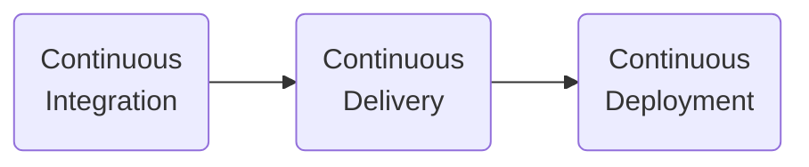
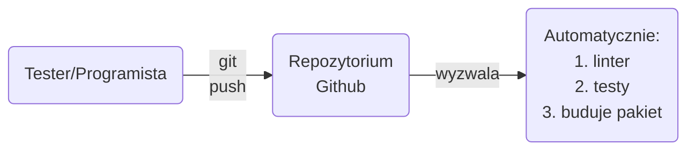
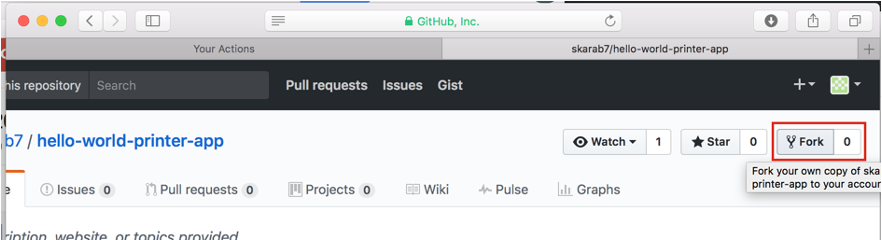
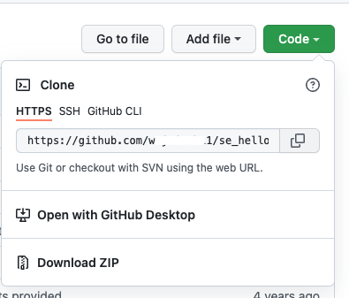

# Continuous Integration &amp; Delivery

Na tym i następnych zajęciach omówimy w jaki sposób automatyzujemy budowę oprogramowania.

Mówimy o trzech procesach:

- Ciągła integracja (*Continuous Integration*)
- Ciągle dostarczanie (*Continuous Delivery*)
- Ciągla instalacja (*Continuous Deployment*)



## 0. Cel na dzisiaj

Naszym celem dzisiaj jest zaimplementowania następującej automatyzacji (*Continuous Integration* i *Continuous Delivery*):



## 1. Przygotowanie do pracy

1. Patrz [instrukcja o podstawach gita](https://github.com/wojciech11/se_software_build_automation_tools/blob/master/01_exercise/README_pl.md).

2. Sprawdź czy masz dobrze skonfigurowanego gita:

   ```bash
   git config -l
   ```

   Powinieneś zobaczyć wyświetlenie konfiguracji z github username i email.

## 2. Przygotowania kodu źródłowego

W czasie tego ćwiczenia, przygotujemy kod źródłowy nad którym będziemy pracować. Jak to w każdej firmie, po krótkim wprowadzeniu, dostajemy adres git-a z projektem, który ma ocalić firmę od bankructwa. Deweloper, biegnąć na kolejne telco, powiedział, że wszystko jest w README.

1. Utwórz fork z repozytorium: https://github.com/wojciech11/se_hello_printer_app

   

2. Sklonuj repozytorium:

   ```bash
   # utworzmy katalog dla naszej pracy
   mkdir -p workspace
   cd workspace
   ```

   ```bash
   # gdzie znaleźć URL?
   # zobacz poniżej
   git clone https://github.com/nazwa_uzytkownika/se_hello_printer_app
   ```

   

3. Przygotuj sobie środowisko do pracy:

   ```bash
   pwd

   ls

   cd se_hello_printer_app
   atom .
   ```

4. Uruchom aplikację, według instrukcji README.md

5. Po uruchomieniu aplikacji otwórz w przeglądarce adres 127.0.0.1:5000

6. Zamiast przeglądarki wykorzystaj narzędzie curl w konsoli bash:

   ```bash
   curl 127.0.0.1:5000

   # w jakich formatach mamy dostępne hallo world
   curl 127.0.0.1:5000/outputs

   # zobczmy jak to działa:
   curl '127.0.0.1:5000/?output=json'
   ```

7. Uruchom testy według poleceń z README.md.

   Najpopularniejszym formatem dla README jest Markdown, coraz rzadziej spotykamy RestructuredText – README.rst.

   Jeśli potrzebujesz inspiracje jak modyfikować Markdown, skorzystaj z [tutoriala](https://docs.github.com/en/get-started/writing-on-github/getting-started-with-writing-and-formatting-on-github/basic-writing-and-formatting-syntax).

8. Czas zanurzyć się w kodzie...

   - Wyszukaj plik python zawierający imię, które widziałaś przy powitaniu,
   - Zmień wartość tej zmienną na swoje imie,
   - Uruchom aplikację i zobacz czy widzisz swoje imie,
   - Uruchom testy i je popraw.

9. Wypchnij zmiany do swojego repozytorium gita na Githubie.

10. [Dodatkowe 1] Znajdź bug w formacie json, popraw (kod i testy), umieść zmiany na githubie:

    ```bash
    curl '127.0.0.1:5000/?output=json'
    ````

    Wyszukaj i zanotuj, czy charakteryzuje się format JSON, porównaj z XML czy YAML.

11. [Dodatkowe 2] Wykorzystaj czas, żeby dowolnie zmodyfikować program na podstawie wskazówek prowadzącego.

12.	Co mógłbyś dodać do pliku README, aby móc samodzielnie uruchomić aplikację?

## 3. Single Point of Project Entry

Każdy projekt powinien mieć a single point of entry. Jest to skrypt albo Makefile, który zawiera najczęściej wykonywane polecenia. Polecenia te powinny być wspólne zarówno w czasie budowania oprogramowania, testowania, jak i budowania pakietu.

Niestety, nasz projekt nie ma takiego skryptu. W tym ćwiczeniu wykorzystamy narzędzie make. Jest to bardzo narzędzie dostarczające wiele funkcjonalności, w naszym projekcie wykorzystamy jego bardzo podstawową funkcjonalność. Cała logika będzie w kodzie bash wywoływanym przez make.

1. Utwórz plik Makefile ([przykład](example/Makefile)). Zauważ, że białe znaki to tabulatory, jeśli korzystasz z Atoma, aktywuj Show Invisibles w Preferences.

   ```makefile
   .PHONY: deps test

   deps:
   	pip install -r requirements.txt; \
   		pip install -r test_requirements.txt
   ```

   deps – instalacja wszystkich pakietów wymaganych dla naszego programu.

2. Naszym zadaniem jest rozszerzenie Makefile, wykorzystując komendy z README.md:

   - lint – uruchomienie lintera (patrz: https://www.python.org/dev/peps/pep-0008/)
   - test - testy
   - run – uruchomienie aplikacji na maszynie dev

   Nasz cel, nowa osoba musi zacząć pracować z projektem, będzie korzystać ze wspólnej konwencji dla wszystkich projektów w naszej firmie.

   ```bash
   # < aktywacja venv
   make deps
   make lint
   make test
   make run
   ````

3. Zacznij od linta:

   ```makefile
   lint:
   	flake8 hello_world test
    ```

    Dodaj teraz targety test i run.

4.	Przetestuj czy komenda deps działa w wierszu lini komend:

    ```bash
    # powinienes zobaczyc instalacje bibliotek
    make deps

    # a tu testy uruchomione
    make test

    # aplikacja powinna wystartowac
    make run
    ````

5. Zobacz co nam powie linter, poczekaj na instruktora, aby omówić problemy:

   ```bash
   make lint
   ```

   Wykorzystaj `# noqa`, aby zignorować błąd w ostatniej linii  `__init__.py`

6. Odpowiedź na pytanie: dlaczego ważne jest single point of entry i README.md?

## 4. Continuous Integration z Github Actions

Jako że czas na otrzymania serwera do ustawienia automatyzacji przedłuża się, postanowiłaś wziąść sprawę w swoje ręce i skorzystać z usługi [Github Actions](https://docs.github.com/en/actions). Przecież projekt może zmienić los firmy.

Posiadanie własnej instalacji Jenkins-a daje nam duże możliwości konfiguracji, jednak ceną jest czas niezbędny do operowania serwera, update-owania pluginów, etc. Dlatego atrakcyjną opcją są usługi CI w chmurze - GitlabCI, Github Actions, CircleCI, etc.

1. Omówienie podstawowych koncepcji z wykładowcą w opraciu o [dokumentacje](https://docs.github.com/en/actions/learn-github-actions/understanding-github-actions):

   - Event - wyzwalanie akcji
   - Workflow - `.github/workflows`
   - Jobs
   - Steps
   - Actions - reużywalne funcjonalności

2. Uttórz katalog:

   ```bash
   # na wszelki, upewnij się
   # ze jestes w glownym katalogu
   # projektu
   pwd

   mkdir -p .github/workflows
   ```

3. Utwórz plik - `.github/workflows/ci.yaml`:

   ```bash
   touch .github/workflows/ci.yaml
   ```

4. Wpisz do niego następującą definicję workflowu (na podstawie [dokumentaji githuba](https://docs.github.com/en/actions/automating-builds-and-tests/building-and-testing-nodejs-or-python?langId=py)):

   ```yaml
   name: Package Project

   # kiedy mam uruchomic automatyzacje
   on: [ push ]

   jobs:
     build_and_test:
       runs-on: ubuntu-latest

       steps:
         # pobierz kod
         - uses: actions/checkout@v3
         # moja aplikacja jest w Pythonie
         - name: Set up Python 3
           uses: actions/setup-python@v3
         # instalacja wymaganych bibliotek
         - name: Install deps
           run: make deps
         # testy!!!!!
         - name: Tests
           run: make test
   ```

5. Umieść `ci.yaml` w repozytorium githuba.

6. Przejdź do interfejsu webowego githuba i przejdź do Actions:

   

7. [Dodatkowe] Dodaj krok, który uruchomi lintera.

## 4. Zbudowanie pakietu

Idziemy za ciosem. Mamy automatyczne testy, teraz chcemy dodać budowę pakietu dla naszego projektu. W ćwiczeniu pokażemy, jak przygotować komponenty gotowe do dostarczenia do klienta w ramach Continuous Delivery.

Celem Continuous Delivery jest przygotowanie artefaktu gotowego do dostarczenia do klienta (Continuous Deployment). Artefaktem może być pakiet (.deb, .rpm), instalator (.msi), w naszym przypadku będzie to obraz Dockera (*Docker image*).

1. Utwórzmy przepis na nasz pakiet (obraz dockera/*Docker image*) - plik `Dockerfile`:

   ```Dockerfile
   FROM python:3

   ARG APP_DIR=/usr/src/hello_world_printer

   WORKDIR /tmp
   ADD requirements.txt /tmp/requirements.txt
   RUN pip install -r /tmp/requirements.txt

   RUN mkdir -p $APP_DIR
   ADD hello_world/ $APP_DIR/hello_world/
   ADD main.py $APP_DIR

   CMD PYTHONPATH=$PYTHONPATH:/usr/src/hello_world_printer \
           FLASK_APP=hello_world flask run --host=0.0.0.0
   ```

Uwaga: Zanim zaczniesz to ćwiczenie, przygotuj sobie drugą zakładkę terminala (ctr-shift-t) lub nowe okno do uruchamiania komend jako root. W nowym terminalu, wywołaj `sudo su` (czym różni się od `sudo su -`?). W tej nowej zakładce, tam gdzie jesteś rootem, wykonaj komendę `docker ps`, aby się upewnić, że możesz wykonać ćwiczenie.

2. Wypieczmy obraz dockera w oknie gdzie jesteś rootem:

   ```bash
   docker build -t hello-world-printer .
   ```

   ```bash
   # zobaczmy czy sie zbudowal nasz obraz
   docker images
   ```

3. Jeśli komponent jest prosty, możemy weryfikować poprawność definicji w czasie
etapu budowy:

   Zmień CMD na RUN i ponownie zbuduj komponent. Jeśli aplikacja się uruchomiła, powróć do poprzedniej wersji Dockerfile.


4. Dodaj target w Makefile-u:

   ```Makefile
   docker_build:
    docker build -t hello-world-printer .
   ```

   Sprawdź w terminalu czy działa:

   ```bash
   # sprawdz czy dziala
   make docker_build
   ```

5. Co to jest dependency hell? Wyszukaj w Google-u.

## 5. Uruchom nasz aplikacje w Dockerze

```bash
docker run --name hello-world-printer-dev -p 5000:5000 -d hello-world-printer
```

```bash
docekr ps
```

```bash
curl 127.0.0.1:5000
````

```bash
# wyswietl logi
docker logs hello-world-printer-dev
```

```bash
# jeśli nie widzisz dockera, kiedy uruchamiasz z docker ps dodaj -a
docker ps -a

docker logs hello-world-printer-dev
```

```bash
# zakoncz program
docker stop hello-world-printer-dev
```

## 6. [Dodatkowe] Więcej komend Docker

Docker zazwyczaj nie restartujemy, kasujemy i uruchamiamy na nowo:

```bash
docker stop hello-world-printer-dev
docker rm hello-world-printer-dev
make docker_run
````

Zauważ, mamy też:

```bash
docker restart NAZWA_DOCKERA
```

Przydatne komendy dockera (pamiętamy o sudo), wychodzimy wpisując exit :

```bash
# możemy uruchomić basha w naszym dockerze image
docker run -it hello-world-printer /bin/bash

# uruchamiamy bash-a w działającym dockerze z naszą aplikacją:
docker exec -it hello-world-printer-dev /bin/bash
```

## 7. Nadawanie właściwego numeru wersji

Mamy pakiet w repozytorium, warto się zastanowić jak poprawnie nadać mu numer wersji. W tym celu poznajmy najpopularniejszą obecnie metodologie Semantic Versioning - [semver](http://semver.org/).

1. Zapoznaj się z opisem i napisz w swoich słowach co to jest Semantic Versioning:

2. Dlaczego MAY i MUST są z dużej litery?

3. Co to jest RFC 2119?

4. Opisz każde z pól następującej wersji:

   - 1.0.1
   - 1.3.2-1
   - 1.4.5+1


5. Jaką wersję mają obecnie poniższe projekty i czy stosują semver?

   - [biblioteka flask](https://flask.palletsprojects.com/en/2.1.x/changes/)
   - Firefox
   - Chrome
   - Libreoffice
   - Android
   - iOS

6. Co to jest Calver (https://calver.org/)?

## 10. Kody HTTP

1. Zanotuj co oznaczają kody:

   - 200
   - 301
   - 302
   - 400
   - 403
   - 404
   - 405
   - 422
   - 500
   - 418

2. Jaki kod http otrzymujemy? Dlaczego?

   ```bash
   curl google.com
   curl -I google.com # <- i z dużej litery
   curl -I google.com -L
   ````

Więcej na [testowanie http API w pigułce](https://github.com/wojciech11/se_http_api_testing_quickstart).

## 8. Smoke Tests

Dodaj do Makefile, prosty smoke test (aka happy-path test):

```Makefile
test_smoke:
	curl --fail 127.0.0.1:5000  
```

alternatywne rozwiązanie - wyświetlenie tylko kodu http:

```Makefile
test_smoke:
	curl -s -o /dev/null -w "%{http_code}" --fail 127.0.0.1:5000
```

## 9. Python - wsparcie dla XMLa

Dowiedzieliśmy się, że nasza aplikacja ma również wspierać format XML.

Wymagania, dla wywołania aplikacji z argumentem `output=xml`:

```bash
curl '127.0.0.1:5000?output=xml'
```

Powinniśmy zwrócić:

```xml
<greetings>
  <name>Natalia</name>
  <msg>Hello World!</msg>
</greetings>
```

Nie musisz korzystać od samego początku z biblioteki, możesz w pierwszej wersji posklejać stringi.

Opcjonalnie, możesz utworzyć branch dla tej implementacji *add_xml_output*, który później zmergujemy z main/master.

Dodaj testy,

Wszystko działa? Tak. Zmerguj z masterem.

## 10. Python - podaje imię w argumencie

Dowiedzieliśmy się, że nasza aplikacja ma obsługiwać imię wpisane w argumencie.

Wymagnia, dla podania argumentu name:

```bash
curl '127.0.0.1:5000?name=apolonia&output=json'
```

Powinniśmy zobaczyć:

```json
{
    "name": "apolonia", "msg": "Hello World"
}
```

Zauważ: Jeśli użytkownik nie poda imienia, użyj jako domyśle `moje_imie`.

Nie zapomnij o testach.

## 11. Python - tworzenie JSONa i XMLa z bibliotekami

Tworzenie JSONa w stringu nie jest poprawne i bardzo podatne na błędy. Refaktoruj aplikację, żeby używała biblioteki json to tworzenia JSONa.

1. Zacznij od zmiany generowania JSONa wraz z poprawą testów:

   ```python
   import json
   ```

2. Popraw generacje XMLa, w tym celu użyj biblioteki `lxml`.

## 12. Python - Popraw testy formatera

Testy formatera (`test_formater.py`) nie są najlepsze, proszę poprawić i objąć testami pozostałem metody outputu.

## Materiały dodatkowe

- Budowanie Docker Image za pomocą Github Actions - [dokumentacja](https://github.com/marketplace/actions/build-and-push-docker-images)
- Lepsze opisy git commitów:
  - [Imperative commit messages](https://chris.beams.io/posts/git-commit/)
  - [semantic commit messages](https://www.conventionalcommits.org/en/v1.0.0-beta.2/)
  - interesujące: [gitmoji-cli](https://github.com/carloscuesta/gitmoji-cli)
